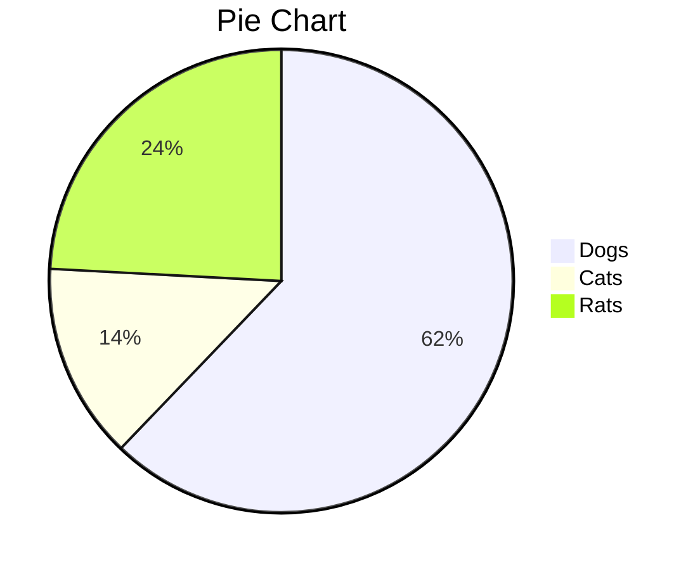
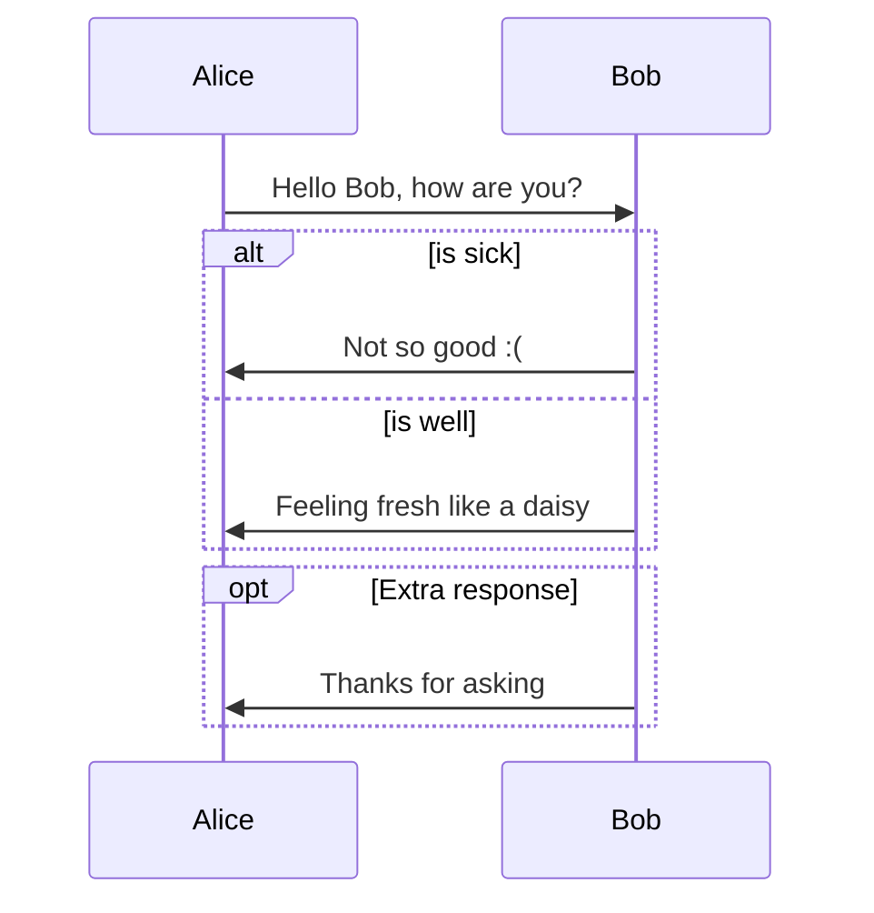
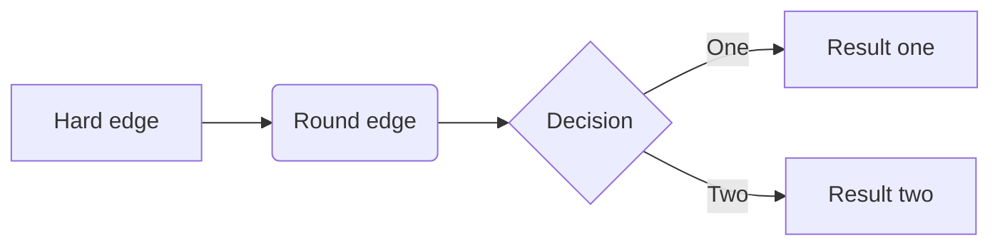
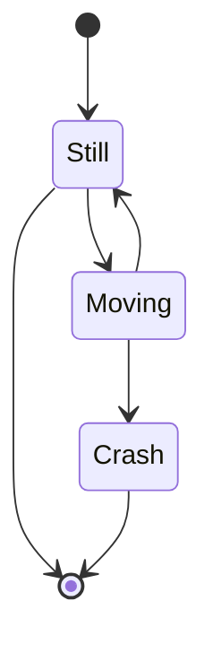

---
Title:	Markdown Test File  
Author: Olaf Wolkenhauer	
Creator: DevonThink  
Date:	June 25, 2022 
Tags: [Markdown, YAML, tags, metadata]  
Category: productivity  
Subject: Tutorial
---

# Markdown Test File

Markdown is a plain text format for writing. The idea is that one focusses on writing and deals with the appearance of your document later. Since the appearance of your text, while writing has also an effect on your writing, I am not convinced that this philosophy makes too much sense. 

The main argument, however, which I subscribe to, is that your texts being written as plain text, will always be readable, even long after new tools and versions of your word processor.

Because one wants to see what the content, say a table, will look like, there are dedicated Markdown editors. The rendering of the preview is then either done in a separate window (wasting screen estate), or the editor has something similar to WYSIWYG, rendering your formatting on the spot, in the same window. 

Another problem, that makes you wonder why people are fond of Markdown, is that there are several versions of it, and not all editors will handle things in the same way, or have the same functionality (e.g. being able to handle LaTeX formatted equations, rendered with MathJax).

The nerds that advertise Markdown tell you that the beauty of it is, that you can then freely choose how to render your text, with total control of the appearance. True in principle, there is a catch. The appearance is done with CSS styles. Some editors will offer a couple of templates but that choice will always be limited and so most likely will end up programming CSS ... which in my view, is a PITA.

Still want to try it? Since one of my favourite Mac apps, DevonThink loves markdown, I have not given up on it and I am still in the process of finding my workflow and Markdown editor of choice.

To this end, I created this file to compare different editors and test CSS style files for rendering/previewing it. It also serves me as a tutorial and cheat sheet for markdown. I copied the material from other guides together, in particular the [Markdown Guide](https://markdownguide.org) and the [MultiMarkdown V6 Syntax Guide](https://rawgit.com/fletcher/MultiMarkdown-6-Syntax-Guide/master/index.html).

## Table of Contents 

The first example of how nice Markdown can be, I inserted in the following line \{\{TOC\}\} and voila, my editor creates a table of content:

{{TOC}}

## Basic formatting of text

Unless a paragraph is in a list, there should not be spaces or tabs before the first word of the paragraph - no indentation, keep paragraphs left aligned.  

End a line with two spaces and then type return.  

You get *italicized text* by typing \*italicized text\*.  

Using two \*\* as in \*\*bold text\*\*,  you get **bold text**. 

However, for some people the \* is more difficult to reach on the keyboard, so they prefer to type \_italicized text\_ to get _italicized text_.

Using three \*\*\* really important \*\*\* you get bold and italicised text\: ***really important***.

But if you find it easier to hit \_ on your keyboard,  you may prefer to type \_\_bold text\_\_ to get __bold text__ and use three \_ in order to get ___strong emphasis___ .

Markdown applications don't agree how to handle underscores in the middle of a words. For this reason, using asterisks are preferred for emphasis within a word. E.g.

	Love**is**in**the**air 

To get this: Love**is**in**the**air 

### Headings

Put a hashtag in front of the heading text. Do not have any space before and have a space between the hashtag and the heading text. Try to put a blank line before and after the heading.

	Use # for the title of a document  
	## for H2
	### for H3
	and #### for H4

This can go on till heading level 6 but whether one can distinguish these levels well, visually, depends on the CSS styling used to render the document:

## This is a H2 heading

### This H3.

#### This H4. 

##### This H5.

Are the differences clearly visible in the particular rendering you are using now to view this document?

### Indentations  

One ahould not indent the start of a paragraph of text, since indentation is used to display code. For example, the following text is not italized since I have a tab space in front of it:

	*not italisized despite the *

I use this in this document a lot to show how something is typed, without rendering it.

### Code

To denote a word or phrase as code, enclose it in backticks \`\`\. Write

	``code``

To get this: ``code``.

### Code blocks

Code blocks are normally indented four spaces or one tab. When they’re in a list, indent them eight spaces or two tabs.  

	1. Open the file.
	2. Find the following code block on line 21:
	
	    <html>
	      <head>
	        <title>Test</title>
	      </head>
	
	3. Update the title to match the name of your website.

The rendered output for which looks like this:

1. Open the file.
2. Find the following code block on line 21:

        <html>
          <head>
            <title>Test</title>
          </head>

3. Update the title to match the name of your website.

#### Fenced code blocks

Use triple backticks on a line above and below the code:

```
{
  "firstName": "John",
  "lastName": "Smith",
  "age": 25
}
```

There is an advanced functionality with syntax highlighting, which not every markdown editor/previewer supports. In the following example, the word \`perl\` after the backticks, indicates the programming language for which the highlighting is done:

```perl
# Demonstrate Syntax Highlighting if you link to highlight.js #
# http://softwaremaniacs.org/soft/highlight/en/
print "Hello, world!\n";
$a = 0;
while ($a < 10) 
{
print "$a...\n";
$a++;
}
```
If you see some of words above highlighted in colour, then your editor is great, that is, it can deal with [Prism](https://prismjs.com).

### Blockquotes

To create a blockquote in Markdown, add a \> in front of a paragraph. The rendered output looks like this\:  

>To create a blockquote, add a \> in front of a paragraph.  

Blockquotes can contain multiple paragraphs. Add a \> on the blank lines between the paragraphs.  

> Blockquotes can contain multiple paragraphs. 
>
> Add a \> on the blank lines between the paragraphs.

#### Nested Blockquotes

Nested blockquotes are also possible, using \>\>\>

>Nested blockquotes
>>> are possible using \>\>\>

Another example with other formatting elements:

> #### The quarterly results look great!
>
> - Revenue was off the chart.
> - Profits were higher than ever.
>
>  *Everything* is going according to **plan**.

### Horizontal lines

To create a horizontal rule, use three or more asterisks \(\*\*\*\), dashes \(---\), or underscores \(\_\_\_\) on a line by themselves.  

---

Best put a blank line before and after the marking for a line.

### Managing line breaks

If you break to a new line in the markdown editor, this does not mean that the rendered text will have a line break at that position. If you want a line to break, add two spaces at the end of the line.

An example where one wants this, is wriiting poetry.

On a Mac, go to System Preferences > Keyboard > Text and deselect the option "Add full stop with double-space" ... as otherwise a dot is added when you type two spaces in succession.

### Links

To create a link, enclose the link text in brackets \(e.g., \[Duck Duck Go\]\) and then follow it immediately with the URL in parentheses \(e.g., \(https\://duckduckgo.com\)\). 

	My favorite search engine is [Duck Duck Go](https://duckduckgo.com).

The rendered output looks like this\: My favorite search engine is [Duck Duck Go](https://duckduckgo.com).

Examples: 

A good overview of writing in markdown is provided by the [Markdown Guide](https://markdownguide.org). Also check out the [MultiMarkdown V6 Syntax Guide](https://rawgit.com/fletcher/MultiMarkdown-6-Syntax-Guide/master/index.html)

The Style Gallery of the [Marked2](https://marked2app.com) app provides examples for CSS file, from which one can learn CSS styling.

To quickly turn a URL or email address into a link, enclose it in angle brackets:

	<https://www.markdownguide.org>
	<fake@example.com>

The rendered output looks like this:

<https://www.markdownguide.org>  
<olaf.wolkenhauer@uni-rostock.de>

Note that without two spaces after the link in the first row, the link and Email address would appear in the same line.

To emphasize links, add asterisks before and after the brackets and parentheses. To denote links as code, add backticks in the brackets.  

	I love supporting the **[EFF](https://eff.org)**.
	This is the *[Markdown Guide](https://www.markdownguide.org)*.
	See the section on [`code`](#code).

Which rendered looks like this:

I love supporting the **[EFF](https://eff.org)**.  
This is the *[Markdown Guide](https://www.markdownguide.org)*.  
See the section on [`code`](#code).  

#### Reference style links

Reference-style links are a special kind of link that make URLs easier to display and read in Markdown. Reference-style links are constructed in two parts: the part you keep inline with your text and the part you store somewhere else in the file to keep the text easy to read.

The first part of a reference-style link is formatted with two sets of brackets. The first set of brackets surrounds the text that should appear linked. The second set of brackets displays a label used to point to the link you’re storing elsewhere in your document.

The second part of a reference-style link is formatted with the following attributes:

1. The label, in brackets, followed immediately by a colon and at least one space (e.g., \[label\]\: ).
2. The URL for the link, which you can optionally enclose in angle brackets.
3. The optional title for the link, which you can enclose in double quotes, single quotes, or parentheses.

Example: I recommend the CSS style file by [Stefan Imhoff][imhoff].

[imhoff]: https://www.stefanimhoff.de/downloads/MarkdownDefault.css

## Tables

Tables can also differ quite a bit for different CSS style files.

| Syntax | Description |
| ----------- | ----------- |
| Header | Title |
| Paragraph | Text |

Creating tables that way is not that convenient. Fortunately, someone created a [Tables Generator](https://www.tablesgenerator.com/markdown_tables). For a table converter look at [TableConvert](https://tableconvert.com)

You can align text in the columns to the left, right, or center by adding a colon \(\:\) to the left, right, or on both side of the hyphens within the header row.  

| Syntax | Description | Test Text | 
| :--- | :----: | ---: |
| Header | Title | Here's this | 
| Paragraph | Text | And more | 

You can align columns to the left, center, or right. Alignment is specific around the dashes below the header cell\:  

- To align left, add a colon to the left, like \:--- \(this is the default\)  
- For right alignment, add a colon to the right, like\: ---\:  
- And finally, for center alignment, add two colons, like\: \:---\:   

For more examples and tips see [Fletcher's MultiMarkdown Syntax Guide](https://github.com/fletcher/MultiMarkdown/wiki/MultiMarkdown-Syntax-Guide)

## Lists

This is a list using the \*:

*   Candy.
*   Gum.

and this list is using the \- \:  

- Candy.  
 	- second level  
 	- second level
- Gum.  

... which should give the same result. Good practice is to use the \-

### Ordered lists

Ordered lists are easy using numbers followed by a dot:

1. first item
2. second item

### Lists with things in between

To add another element in a list while preserving the continuity of the list, indent the element four spaces or one tab, as shown in the following examples.

	* This is the first list item.
	* Here's the second list item.
	
		I need to add another paragraph below the second list item.
	
	* And here's the third list item.

Produces this:

* This is the first list item.
* Here's the second list item.

   I need to add another paragraph below the second list item.

* And here's the third list item.

### Nesting ordered and unordered lists

You can nest an unordered list in an ordered list, or vice versa:

	1. First item
	2. Second item
	3. Third item
		- Indented item
		- Indented item
	4. Fourth item

which produces this:

1. First item
2. Second item
3. Third item
    - Indented item
    - Indented item
4. Fourth item

### Task lists

- [x] A to do that is done.
- [ ] Another thing to be done.

### Definition lists

term
: definition

## Images

The file for the image has to be in the folder of the text to show here in this markdown sample file.

If the image doesn't show here, the file may be missing, or in a different location.

Here should appear an image: 

Here are examples of linking an image in DevonThink:

- ````\: Use this when linking to an item in the same group as the Markdown document. 
- ````\: Use this when linking to an item in a sub-group of the group containing the Markdown document. 
- ````\: Use this when you are linking to an item in a group outside the group containing the Markdown document. For example, if you have common resources in a specific group, you can link to them using this format.

### Image with title above the image


### Image with caption text below the image

 

### Image with attributes

Here comes an image with attributes set: ![image-with-attributes]

[image-with-attributes]: logo.png "For this image, the height and width are specified" height=22px width=60px

With Devonthink, this is all working well, although the iOS version, Devonthink2Go, does not render the images with size changes.

Editing markdown files in Devonthink with the Typora editor, the images are not shown. You see, it can be complicated, despite the nerds telling you otherwise :) When it comes to equations, things also get messy (see below).

## Miscellaneous things

### Strikethrough

~~The world is flat.~~

### Highlighting

Enclose your text with two equal signs \=\= , to ==highlight the text==.

### Criticmarkup

- This {++is ++}a test.
- This is {--is --}a test.
- This {~~isn't~>is~~} a test.
- This is a {==test==}.
- This is a test. {>>What is it a test of?<<}

### Subscript

H~2~O

Not every markdown editor supports all the the things listed here. Highlighting, sub and superscripts for example are  ot supported by all editors.

### Superscript

X^2^

### Emoji

CSS styling is such a joy! :joy:

### Glossary

[?Glossary] is a glossary term.  

[?Glossary]: The glossary collects information about important terms used in your document.  

[?(Glossary) The glossary collects information about important terms used in your document] is a glossary term.  

Check the end of the rendered version of this document to see what happens.

### Citations

One can cite literature as well, like this [p. 42][#source]

[#source]: Olaf Wolkenhauer. *Stochastic Approaches for Systems Biology*. Springer Verlag, 2011.

... or like this [p. 42][#Olaf Wolkenhauer. *Nich lang schnaken*. Quickborn Verlag, 2012.]

Check the end of the rendered version of this document.

### Footnotes

Here's a sentence with a footnote.[^1] The footnote will be at the bottom of this page.

... or using an inline footnote.[^This is an inline footnote.]

[^1]: This is the footnote.

Check the end of the rendered version of this document to see the footnote.

## Diagrams with Mermaid

Check out the excellent [Typora](https://typora.io) article about how to [Draw Diagrams with Markdown](https://support.typora.io/Draw-Diagrams-With-Markdown/).

Your editor must be able to handle [Mermaid](https://mermaid-js.github.io/mermaid/#/) to render the following diagrams.

### Ex Pie Charts



### Ex Sequence Diagrams



### Ex Graphs



### Ex State Diagrams



## Mathematics

[MathJax](https://www.mathjax.org) is a JavaScript engine for mathematics. Not all editors support it, but if they do, the results are like in LaTeX documents.

To begin with, for basic maths that is inserted in a sentence/paragraph:

	Formulas *can* be inline: ${e}^{i\pi }+1=0$.

Which renders as: Formulas *can* be inline: ${e}^{i\pi }+1=0$.

The double \$\$ delimeter produces a centered math expression. This works within backticks:

	$$a^2 + b^2 = c^2$$

Renders as 

$$a^2 + b^2 = c^2$$

Another, more complex example:

	<div>
	$$
	\begin{vmatrix}
	  a & b\\  
	  c & d
	\end{vmatrix}
	=ad-bc
	$$
	<div>

Which renders as:

<div>
$$
\begin{vmatrix}
   a & b\\  
   c & d
\end{vmatrix}
=ad-bc
$$
<div>

Well, if it did not work in your editor, then this may be because of the ``<div>``. The Typora editor does not handle them but in DevonThink the rendering doesn't work well without them. I take from it that simple equations are fine, most editors will understand them but with more complex maths writing, one is better off with something like Overleaf.

To test this, I inserted here below the same equation, without the ``<div>``

$$
\begin{vmatrix}
   a & b\\  
   c & d
\end{vmatrix}
=ad-bc
$$

With the Typora editor this now looks fine but in DevonThink, the two rows of the matrix are not shown. Devonthink renders the equation but not correctly. 

And here comes Bayes' Theorem:

	<div>
		\begin{equation}
		  \label{eq:bayes}
		  P(\theta|\textbf{D}) = P(\theta ) \frac{P(\textbf{D}|\theta)}{P(\textbf{D})}
		\end{equation}
	</div>

Rendered:

<div>
    \begin{equation}
    \label{eq:bayes}
    P(\theta|\textbf{D}) = P(\theta ) \frac{P(\textbf{D}|\theta)}{P(\textbf{D})}
    \end{equation}
</div>


## Metadata

Metadata are things like the author, the date etc. They can be added at the top of the markdown file and will not be rendered.

See above in the raw markdown of this file. More information on metadata can be found in tehe Markdown guides I referred to above.

## Final note

Now that I have written this text in the Devonthink Markdown editor, printing it into a pdf, it takes the fonts and fontsizes that I chose for editing. There is no option to adjust fontsizes and appearance in the printing menu. I would have to choose a CSS style file, or ... or ... which is why I like Markdown in principle, but really it is not for the ordinary user who wants things well designed out of the box and with maximum comfort.

Opening this file with the Typora editor, I have a couple of "themes" available. A popular example is the Github style flavor. So, I was happy with that theme and choose it to export the text into a pdf file. Well, I wished a smaller fontsize but that would require me to edit the CSS style file ... There is no menu to quickly adjust the fontsize of the rendered document. Quickly setting the text to a block-jusitified format? No, not possible. Yes, there are still people out that try to convince you that this is no problem at all. I guess many of them are programmers :)

PS: In DevonThink, I can add the following at the top of a markdown file to reduce the fontsize of the preview and thus in printing:

	<style>body, td, th, div, p {font-size: 10pt;}</style>